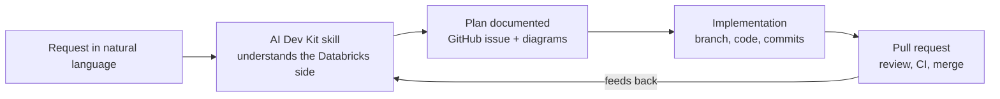

# Databricks IA Environment

## Configuration

### Databricks AI Dev Kit

A toolkit for coding agents (Claude Code, Codex, Cursor, and others) provided by Databricks Field Engineering, giving them Databricks-specific knowledge, skills, MCP tools, and the Databricks Builder App to build reliable workflows, pipelines, and dashboards faster. See the [Databricks AI Dev Kit GitHub repository](https://github.com/databricks-solutions/ai-dev-kit) for installation instructions.

### GitHub MCP

Connect to the GitHub remote MCP server using the Claude CLI:

```
claude mcp add --transport http github https://api.githubcopilot.com/mcp/ --header "Authorization: Bearer <YOUR_TOKEN>"
```

To authenticate, generate a **fine-grained personal access token** in GitHub with the minimum permissions needed:

- **Repository access**: limit it to only the repository/repositories that are necessary — never grant access to all repositories.
- **Permissions**: grant only what's needed for now — `Contents` (commits), `Issues`, and `Pull requests` (read/write as applicable).

### Databricks MCP

```
claude mcp add databricks-sql-mcp --transport http "https://<your-workspace-hostname>/api/2.0/sql" --header "Authorization: Bearer <YOUR_TOKEN>"
```

Replace `<your-workspace-hostname>` with your Databricks workspace URL and `<YOUR_TOKEN>` with a Databricks personal access token.

## Capabilities: Databricks AI Dev Kit + GitHub MCP

The value of this environment isn't either tool alone — it's the workflow that forms when they're connected: an agent that understands the Databricks side of a problem (data, pipelines, ML) and can act on the GitHub side (issues, branches, PRs, code) in the same conversation, without a human relaying context between two separate tools.

### What the Databricks AI Dev Kit brings

The kit installs a catalog of skills (`.claude/skills/`) that give the agent Databricks-specific knowledge it wouldn't reliably have from general training alone — current APIs, platform conventions, and guardrails for each product area. Roughly grouped:

| Category | Skills cover |
|---|---|
| Ingestion & pipelines | Lakeflow / Spark Declarative Pipelines (SDP), Auto Loader, CDC/SCD Type 2, structured streaming, Zerobus ingest, custom PySpark data sources |
| Storage & governance | Unity Catalog objects/grants/tags/monitors, volumes, Iceberg tables & interop, Lakebase (provisioned + autoscale) |
| SQL & data modeling | DBSQL best practices, SQL scripting, materialized views, metric views, geospatial/collation features |
| ML, agents & evaluation | Model serving, agent evaluation, MLflow tracing/metrics/traces, GEPA prompt optimization, agent bricks (Genie, Knowledge Assistants, Supervisor Agents) |
| AI-native SQL | Built-in AI functions (`ai_query`, `ai_classify`, `ai_extract`, `ai_forecast`, document parsing, RAG prep) |
| Apps, dashboards & jobs | Databricks Apps (Python/AppKit), AI/BI (Lakeview) dashboards, Jobs (schedules, triggers, monitoring), Asset Bundles for CI/CD |
| Data & platform ops | Synthetic data generation, vector search, workspace/CLI config, system tables |

Each skill is scoped narrowly on purpose — the agent loads only the ones relevant to a given request instead of reasoning from general knowledge about a fast-moving platform.

### What GitHub MCP brings

The GitHub MCP server gives the agent direct, authenticated access to the repository as a first-class actor rather than a text generator the human has to copy-paste from. In practice that covers:

- **Planning surfaces** — creating/searching/updating issues, sub-issues, labels, and custom fields
- **Change surfaces** — branches, commits, file reads/writes, pull requests (create, review with inline comments, merge)
- **Review & CI surfaces** — requesting Copilot review, reading commit/PR status, secret scanning
- **Discovery** — searching code, commits, issues, and PRs across accessible repos

### The combined workflow



Concretely: a request like "build a pipeline for X" pulls in schema/platform knowledge from the AI Dev Kit skills, gets turned into a structured GitHub issue (tables, layers, relationships) via GitHub MCP, and — in the same session — can continue straight into scaffolding the pipeline code and opening a PR against that issue. Nothing has to be re-explained crossing from the "data" half to the "repo" half, because both live in the same tool call surface.

See [`presentation_guide.md`](presentation_guide.md) for a live, worked example of this workflow end to end.
